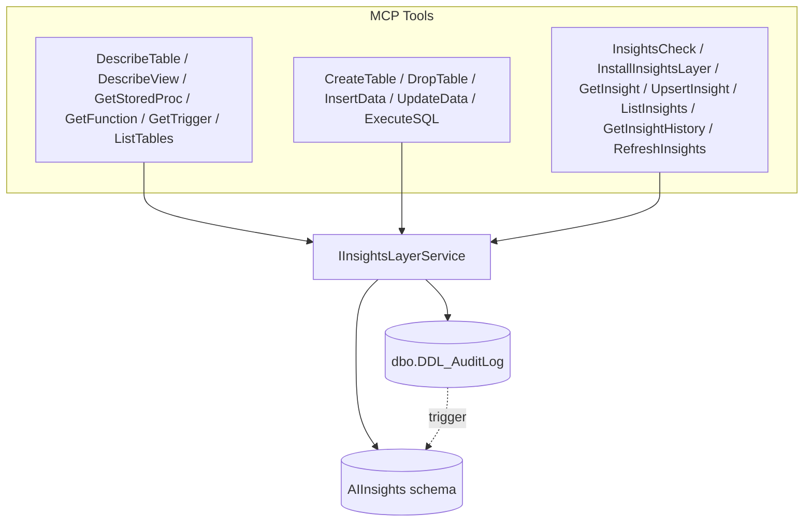

## Goals

1. Rewrite `documentation/ai_insights_guide.md` (Hebrew + outdated) into a v2 spec aligned with the actual code: .NET 9, `ModelContextProtocol` 0.1.0-preview.10, partial-class `Tools`, DI via `ISqlConnectionFactory`, and `DbOperationResult` return shape.
2. Implement the layer behind an `IInsightsLayerService` injected into [`Tools`](MssqlMcp/Tools/Tools.cs).
3. Install is **explicit only** — one MCP install tool (`InstallInsightsLayer`) that provisions both AIInsights and DDL_AuditLog/trigger. No env-var auto-create on startup.
4. When the layer is present, **every introspection tool** auto-attaches the cached insight to its response.
5. When the layer is present, **every write tool** runs a fast post-write change-detection pass that **soft-deletes** affected insights (archives them into `AIInsights.InsightHistory`) so the next read returns `null` and forces a fresh analysis. Two detection sources: DDL_AuditLog watermark (preferred) and `sys.objects.modify_date` + schema fingerprint mismatch (fallback).

## High-level architecture



## File layout (new + modified)

New folder `MssqlMcp/InsightsLayer/`:
- `IInsightsLayerService.cs`
- `InsightsLayerService.cs`
- `Models/SchemaInsight.cs`, `Models/InsightFreshness.cs`, `Models/LayerStatus.cs`
- `SqlScripts/CreateInsightsSchema.sql` (embedded resource — modernized v2 layer, includes DDL_AuditLog + trigger bootstrap)

New tool files in [`MssqlMcp/Tools/`](MssqlMcp/Tools/):
- `InsightsCheck.cs`, `InstallInsightsLayer.cs`
- `GetInsight.cs`, `UpsertInsight.cs`, `ListInsights.cs`, `GetInsightHistory.cs`, `RefreshInsights.cs`

Modified existing files:
- [`Tools/Tools.cs`](MssqlMcp/Tools/Tools.cs) — primary constructor accepts `IInsightsLayerService?`
- [`Program.cs`](MssqlMcp/Program.cs) — register `IInsightsLayerService` as singleton (only if `USE_INSIGHTS_LAYER=true`; otherwise registered as a no-op stub so `Tools` doesn't have to null-check everywhere)
- [`MssqlMcp.csproj`](MssqlMcp/MssqlMcp.csproj) — `<EmbeddedResource Include="InsightsLayer\SqlScripts\*.sql" />`
- Introspection tools that auto-attach insights: [`DescribeTable.cs`](MssqlMcp/Tools/DescribeTable.cs), [`DescribeView.cs`](MssqlMcp/Tools/DescribeView.cs), [`GetStoredProc.cs`](MssqlMcp/Tools/GetStoredProc.cs), [`GetFunction.cs`](MssqlMcp/Tools/GetFunction.cs), [`GetTrigger.cs`](MssqlMcp/Tools/GetTrigger.cs)
- Write tools that trigger invalidation: [`CreateTable.cs`](MssqlMcp/Tools/CreateTable.cs), [`DropTable.cs`](MssqlMcp/Tools/DropTable.cs), [`InsertData.cs`](MssqlMcp/Tools/InsertData.cs), [`UpdateData.cs`](MssqlMcp/Tools/UpdateData.cs), [`ExecuteSQL.cs`](MssqlMcp/Tools/ExecuteSQL.cs)
- [`README.md`](README.md) — new tools section + `USE_INSIGHTS_LAYER` env var

Renamed/rewritten docs:
- [`documentation/ai_insights_guide.md`](documentation/ai_insights_guide.md) → fully rewritten v2 (English primary, with the original Hebrew preserved in an appendix)

## v2 SQL schema changes (in `CreateInsightsSchema.sql`)

On top of the existing six tables from [`ai_insights_layer.sql`](documentation/ai_insights_layer.sql), the v2 script adds the columns and tables needed for soft-delete + DDL-driven invalidation:

- `AIInsights.SchemaInsights` — add `ModifyDateAtAnalysis DATETIME2 NULL`, `SchemaFingerprint VARCHAR(64) NULL` (HASHBYTES of column list / definition), plus a covering index on `(ObjectType, SchemaName, ObjectName)`.
- New `AIInsights.InsightHistory` — same columns as `SchemaInsights` plus `ArchivedAt DATETIME2`, `ArchiveReason NVARCHAR(200)`, `ArchivedByEvent NVARCHAR(64)`, `SourceDdlAuditID INT NULL`.
- New `AIInsights.DdlChangeWatermark` — single-row tracker `LastProcessedAuditID INT, LastProcessedAt DATETIME2`.
- No new stored procedures or views for layer maintenance; keep maintenance logic in C# to reduce DB-object coupling.
- Script is fully idempotent: every `CREATE` guarded by `IF NOT EXISTS` / `IF OBJECT_ID(...) IS NULL`, every `ALTER TABLE ... ADD` guarded by `sys.columns` check. Re-running the install tool is safe.

## DDL_AuditLog install behavior

The DDL audit SQL provided by the user is embedded into `CreateInsightsSchema.sql` install flow — verbatim — wrapped only in:

```sql
IF OBJECT_ID('dbo.DDL_AuditLog','U') IS NULL
BEGIN
    -- (full table DDL from user)
END
GO
IF NOT EXISTS (SELECT 1 FROM sys.triggers WHERE name='DDL_Audit' AND parent_class=0)
BEGIN
    -- (full trigger DDL from user, executed via sp_executesql because trigger
    -- bodies cannot be inside an IF block at the DDL-trigger level on database)
END
GO
```

The trigger body, `ENABLE TRIGGER [DDL_Audit] ON DATABASE`, and the "last modified..." `PRINT` block are kept untouched.

`InstallInsightsLayer.cs` catches the common failure modes and returns a friendly `error`:
- `EXECUTE permission denied on ALTER ANY DATABASE DDL TRIGGER` → surface "User lacks CREATE/ALTER DDL TRIGGER permission".
- Already exists → idempotent success with `data.alreadyInstalled = true`.

## Service contract (key methods)

```csharp
public interface IInsightsLayerService
{
    bool IsEnabled { get; }                                              // USE_INSIGHTS_LAYER env var
    Task<LayerStatus> GetStatusAsync(CancellationToken ct);              // schema present? audit present? counts
    Task<DbOperationResult> InstallLayerAsync(CancellationToken ct);     // runs CreateInsightsSchema.sql idempotently (includes DDL_AuditLog + trigger)

    // Read path -- called by Describe* / Get* tools
    Task<(SchemaInsight? insight, InsightFreshness freshness)> GetInsightForObjectAsync(
        string objectType, string? schemaName, string objectName, CancellationToken ct);

    Task<DbOperationResult> UpsertInsightAsync(SchemaInsight insight, CancellationToken ct);

    // Write path -- called fire-and-forget after every write tool succeeds
    Task ProcessDdlChangesAsync(CancellationToken ct);

    // Manual / admin
    Task<DbOperationResult> ListInsightsAsync(string? schemaName, string? objectType, CancellationToken ct);
    Task<DbOperationResult> GetHistoryAsync(string? schemaName, string? objectName, CancellationToken ct);
}
```

`GetInsightForObjectAsync` is where the fingerprint compare lives:
1. Look up the row in `AIInsights.SchemaInsights`.
2. If found, query `sys.objects.modify_date` + compute current fingerprint (column-list hash for tables; `OBJECT_DEFINITION` hash for procs/views/funcs/triggers).
3. If `ModifyDateAtAnalysis != current modify_date` **or** `SchemaFingerprint != current`, archive row to `InsightHistory` in C# transaction with reason `"FingerprintMismatch"`, then return `(null, freshness=stale_archived)`.
4. Otherwise return `(insight, freshness=fresh)`.

## New MCP tools

All new tools follow the existing `[McpServerTool]` + `DbOperationResult` pattern.

- `InsightsCheck` — `ReadOnly=true`. Returns `{ layerInstalled, ddlAuditInstalled, ddlAuditTriggerEnabled, schemaInsightsCount, lastProcessedAuditID, lastProcessedAt }`.
- `InstallInsightsLayer` — `ReadOnly=false, Destructive=false`. Runs the embedded `CreateInsightsSchema.sql` that installs AIInsights plus DDL_AuditLog/trigger. Idempotent. Returns clear error if permissions missing.
- `GetInsight(objectName, schemaName?, objectType?="Table")` — calls `GetInsightForObjectAsync`. Returns insight + freshness.
- `UpsertInsight(objectType, schemaName, objectName, description, businessPurpose?, dataPatterns?, usageGuidelines?, relatedObjects?, llmModel, confidence, analyzedBy)` — calls `UpsertInsightAsync`. Captures fingerprint server-side.
- `ListInsights(schemaName?, objectType?)` — paginated, ordered by `LastAnalyzed DESC`.
- `GetInsightHistory(schemaName?, objectName?)` — reads `InsightHistory` so the LLM can see what was archived and why.
- `RefreshInsights` — `ReadOnly=false, Destructive=false`. Manually invokes `ProcessDdlChangesAsync` (useful when DDL audit just got installed and the user wants to backfill).

## Auto-attach on introspection tools

`DescribeTable`, `DescribeView`, `GetStoredProc`, `GetFunction`, `GetTrigger` are modified so that **after** the existing result dictionary is built, they add an `insight` key when the layer is enabled:

```csharp
if (_insights.IsEnabled)
{
    var (insight, freshness) = await _insights.GetInsightForObjectAsync(
        objectType: "Table", schemaName: schema, objectName: name, ct: default);
    result["insight"] = insight is null ? null : new { /* projection */ };
    result["insightFreshness"] = freshness.ToString();   // "fresh" | "stale_archived" | "absent" | "layer_disabled"
}
```

If the layer call throws or layer is disabled, the introspection tool **still returns its normal data** — the insight enrichment is best-effort and never fails the parent tool. Logged at `Debug`.

## Auto-update on write tools

Every existing write tool — [`CreateTable.cs`](MssqlMcp/Tools/CreateTable.cs), [`DropTable.cs`](MssqlMcp/Tools/DropTable.cs), [`InsertData.cs`](MssqlMcp/Tools/InsertData.cs), [`UpdateData.cs`](MssqlMcp/Tools/UpdateData.cs), [`ExecuteSQL.cs`](MssqlMcp/Tools/ExecuteSQL.cs) — gains a single post-success line:

```csharp
if (_insights.IsEnabled)
{
    _ = Task.Run(() => _insights.ProcessDdlChangesAsync(CancellationToken.None));
}
```

`ProcessDdlChangesAsync` does:
1. If `dbo.DDL_AuditLog` doesn't exist → fall back to fingerprint-only scan of all `SchemaInsights` rows. Quiet success.
2. Otherwise, read new audit rows since watermark directly in C#, archive matching insights into `InsightHistory`, and advance watermark.
3. Errors are logged at `Warning` but never propagated to the parent tool's caller. The user's `CreateTable` / `UpdateData` result is unaffected by insight-layer failures.

`InsertData` and `UpdateData` realistically don't change schema, but running the watermark pass is cheap (one indexed read of `DDL_AuditLog` since last ID) and covers cases where someone uses those tools with an `ExecuteSQL`-equivalent payload.

## .NET 9 / current-best-practice modernizations applied to the old guide

- Primary constructors on `Tools` (already in place; extend to inject `IInsightsLayerService`).
- `await using` for `SqlConnection` / `SqlCommand`.
- `CancellationToken` plumbed through every service method.
- Keep simple operations in C# (single SELECT/UPDATE/INSERT) with parameterized `SqlCommand`; avoid adding DB stored procedures/views for routine logic.
- Embedded SQL via `<EmbeddedResource>` instead of file-on-disk lookup (the original plan in [`insights_implementation_plan.md`](documentation/insights_implementation_plan.md) tried to do this but never landed).
- Structured logging with named placeholders (`_logger.LogInformation("Archived insight {InsightId} due to {Reason}", id, reason)`).
- `[McpServerTool(ReadOnly = ..., Idempotent = ..., Destructive = ...)]` flags set correctly on all new tools.
- `DbOperationResult` extended only if needed (probably not — `data` is `object?` and accepts the projection).
- Drop `GRANT ... TO [public]` from the old script; the v2 install tool prints a follow-up reminder about role-based grants but does not perform them itself.
- Use `UPDATE` then `@@ROWCOUNT` check then `INSERT` for upsert (no `IF EXISTS` pre-check), implemented inside C# service/repository commands.
- Soft-delete on invalidation (per user decision) — no more `DELETE FROM SchemaInsights WHERE Confidence < 0.5 ...` recommendation; that's superseded by `InsightHistory`.

## Tests

Add to [`MssqlMcp.Tests/`](MssqlMcp.Tests/):
- `InsightsLayerServiceTests` — install idempotency, fingerprint mismatch detection, archive-on-mismatch returns `null`, DdlChangeWatermark advances correctly.
- `InsightsToolsTests` — `InsightsCheck` returns correct status when layer absent / partial / full; `UpsertInsight` round-trips through `GetInsight`; in-code recent/top query calculations match expected results.
- Integration test exercising `CreateTable` → `UpsertInsight` → `ExecuteSQL("ALTER TABLE ...")` → `GetInsight` returns `null` + history row present.

## Out of scope (explicitly)

- No env-var auto-install (per user decision).
- No automatic LLM call to regenerate insights — the MCP server has no model client. Stale ⇒ archived ⇒ next read returns `null`; the LLM in the calling client is expected to re-analyze and call `UpsertInsight`.
- No changes to authentication / permissions model beyond surfacing clear errors.
- The Hebrew narrative content in the original guide is preserved as `documentation/ai_insights_guide.md` § "Appendix A — Original Hebrew Guide (v1, archived)". The body of the file becomes the English v2 spec.
