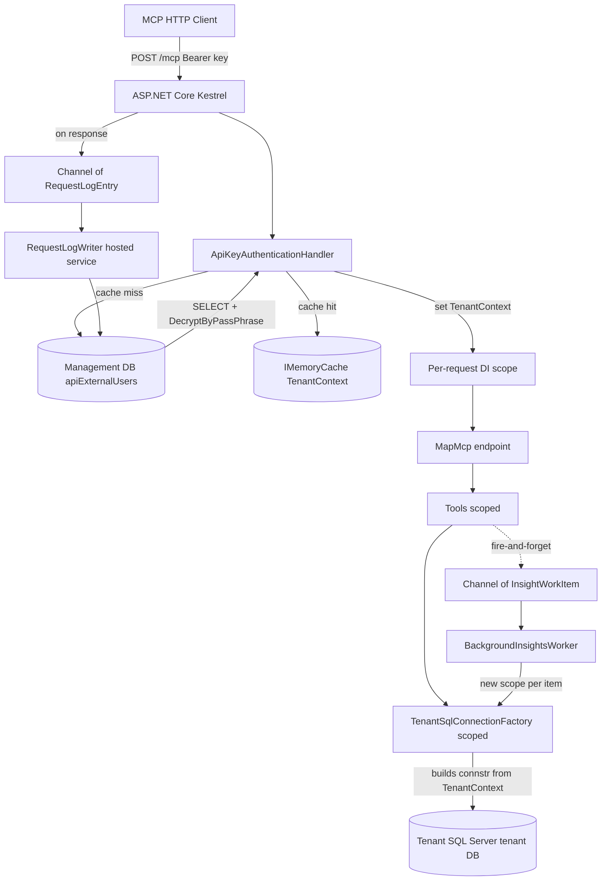

# MSSQL MCP HTTP + API-Key Auth

## 1. Context and goals

Today [MssqlMcp/Program.cs](MssqlMcp/Program.cs) wires a single-tenant stdio MCP server: one `CONNECTION_STRING` env var, one DB per process. We want one long-running HTTP service that:

- Accepts MCP Streamable HTTP at `/mcp` with `Authorization: Bearer <api_key>`.
- Routes each request to its own SQL Server / database based on the key's row in `dbo.apiExternalUsers` on a dedicated **management DB**.
- Encrypts the SQL login (`enc_sql_user` / `enc_sql_pswd`) at rest using SQL Server's built-in `EncryptByPassPhrase`, with the passphrase loaded from `.env`.
- Enforces an optional per-key IP allowlist (`source_ip_csv`).
- Logs every request to a new `dbo.apiRequestLog` table for auditing.
- Exposes admin endpoints + a CLI subcommand to create / revoke keys without raw SQL.
- Keeps the existing stdio path working unchanged, switched via `MCP_TRANSPORT={stdio|http}` (default `stdio`).
- Coexists with the AI Insights Layer v2 plan currently in development.

Single-stage delivery: the DI lifetime change (scoped `Tools` + scoped `ISqlConnectionFactory`) ships together with auth, management DB, and admin surface in one PR.

## 2. End-to-end flow



## 3. Transport switch (HTTP + stdio kept)

[MssqlMcp/Program.cs](MssqlMcp/Program.cs) splits into two builder paths:

```csharp
var transport = Environment.GetEnvironmentVariable("MCP_TRANSPORT") ?? "stdio";
return transport.Equals("http", StringComparison.OrdinalIgnoreCase)
    ? await HttpHost.RunAsync(args)
    : await StdioHost.RunAsync(args); // existing path, untouched
```

`HttpHost.RunAsync` uses `WebApplication.CreateBuilder` and the SDK's HTTP transport per the [official C# SDK guidance](https://github.com/modelcontextprotocol/csharp-sdk/blob/main/docs/concepts/transports/transports.md):

```csharp
builder.Services
    .AddMcpServer()
    .WithHttpTransport(o => o.Stateless = true) // uses HttpContext.RequestServices => per-request scope
    .WithToolsFromAssembly()
    .AddAuthorizationFilters();

builder.Services.AddAuthentication(ApiKeyAuthDefaults.Scheme)
    .AddScheme<ApiKeyAuthenticationOptions, ApiKeyAuthenticationHandler>(ApiKeyAuthDefaults.Scheme, _ => { });
builder.Services.AddAuthorization(o => o.AddPolicy("McpUser", p => p.RequireAuthenticatedUser()));

app.MapMcp("/mcp").RequireAuthorization("McpUser");
app.MapAdminEndpoints(); // /admin/* guarded by separate AdminApiKeyAuthHandler
```

`csproj` switches the SDK to `Microsoft.NET.Sdk.Web` and adds:

- `Microsoft.AspNetCore.Authentication` (framework reference via `Microsoft.NET.Sdk.Web`).
- `Microsoft.Extensions.Caching.Memory` (in framework).
- `DotNetEnv` for `.env` loading.

`StdioHost.RunAsync` is the current `Program.Main` body verbatim, including the connection-string env-var validation. Existing `sample_mcp.json` keeps working unchanged.

## 4. Configuration via .env

Loaded once at startup via `DotNetEnv.Env.Load()` from the executable directory. All values are also overridable by real environment variables (env vars win).

```
# .env (next to MssqlMcp.exe)
MCP_TRANSPORT=http
MCP_HTTP_URLS=http://localhost:5174

# Management DB (holds apiExternalUsers, apiRequestLog, apiKeyAuditLog)
MGMT_CONNECTION_STRING=Server=.;Database=MssqlMcpMgmt;Trusted_Connection=True;TrustServerCertificate=True

# Passphrase fed to EncryptByPassPhrase / DecryptByPassPhrase
MGMT_CRED_PASSPHRASE=<long random string>

# Master key for /admin/* endpoints (not stored in DB to avoid bootstrap chicken-and-egg)
ADMIN_API_KEY=<long random string>

# Cache TTL for resolved TenantContext (decrypted) - seconds
TENANT_CACHE_TTL_SECONDS=300

# Carried over for stdio mode and as fallback for HTTP without an auth context
CONNECTION_STRING=Server=...;Database=...;...
LOG_FILE_PATH=C:\Development\MCPs\MS-SQL\log\mssql_mcp_log.txt

# Insights layer (matches the in-progress AI Insights v2 plan)
USE_INSIGHTS_LAYER=true
```

`.env` is added to `.gitignore`. A `.env.example` ships alongside.

## 5. Management database schema

New file `documentation/sql/mgmt_schema.sql` (idempotent, runnable many times):

```sql
-- API key directory. api_key kept as plaintext lookup column per design decision
-- (caller-facing key is the auth secret; what we protect at rest is the SQL login
-- the key resolves to). varchar(max) replaced with varchar(128): EncryptByPassPhrase
-- ciphertext lives in dedicated varbinary(max) columns, and varchar(max) cannot be a PK.
IF OBJECT_ID('dbo.apiExternalUsers','U') IS NULL
BEGIN
    CREATE TABLE dbo.apiExternalUsers (
        api_key         varchar(128)     NOT NULL CONSTRAINT PK_apiExternalUsers PRIMARY KEY CLUSTERED,
        customerID      int              NOT NULL,
        used_for        varchar(250)     NULL,
        is_active       bit              NOT NULL CONSTRAINT DF_apiExternalUsers_is_active DEFAULT (1),
        srvName         nvarchar(128)    NULL,
        dbName          nvarchar(128)    NULL,
        enc_sql_user    varbinary(max)   NULL,  -- EncryptByPassPhrase(@pass, sql_user)
        enc_sql_pswd    varbinary(max)   NULL,  -- EncryptByPassPhrase(@pass, sql_pswd)
        source_ip_csv   varchar(max)     NULL,
        DateCreated     smalldatetime    NOT NULL CONSTRAINT DF_apiExternalUsers_DateCreated DEFAULT (GETDATE()),
        LastRequest     datetime         NULL,
        LastIPAddress   varchar(64)      NULL
    );
END
GO

-- Auditable request log. Indexed by (api_key, timestamp) for "last N calls per key".
IF OBJECT_ID('dbo.apiRequestLog','U') IS NULL
BEGIN
    CREATE TABLE dbo.apiRequestLog (
        id            bigint         IDENTITY(1,1) NOT NULL CONSTRAINT PK_apiRequestLog PRIMARY KEY CLUSTERED,
        api_key       varchar(128)   NOT NULL,
        customerID    int            NOT NULL,
        ts            datetime2(3)   NOT NULL CONSTRAINT DF_apiRequestLog_ts DEFAULT (SYSUTCDATETIME()),
        source_ip     varchar(64)    NULL,
        tool_name     varchar(100)   NOT NULL,
        success       bit            NOT NULL,
        duration_ms   int            NOT NULL,
        bytes_out     int            NULL,
        error_message nvarchar(2000) NULL
    );
    CREATE INDEX IX_apiRequestLog_key_ts ON dbo.apiRequestLog (api_key, ts DESC);
    CREATE INDEX IX_apiRequestLog_ts     ON dbo.apiRequestLog (ts);
END
GO

-- Admin actions on keys (create, revoke, edit).
IF OBJECT_ID('dbo.apiKeyAuditLog','U') IS NULL
BEGIN
    CREATE TABLE dbo.apiKeyAuditLog (
        id          bigint         IDENTITY(1,1) NOT NULL CONSTRAINT PK_apiKeyAuditLog PRIMARY KEY CLUSTERED,
        api_key     varchar(128)   NOT NULL,
        action      varchar(20)    NOT NULL,        -- 'create' | 'revoke' | 'reactivate' | 'update_creds' | 'update_ips'
        actor       varchar(128)   NULL,            -- caller of /admin (or 'cli')
        at          datetime2(3)   NOT NULL CONSTRAINT DF_apiKeyAuditLog_at DEFAULT (SYSUTCDATETIME()),
        details     nvarchar(1000) NULL
    );
END
GO
```

Inserts use parameterized SQL with `EncryptByPassPhrase`:

```sql
INSERT INTO dbo.apiExternalUsers
    (api_key, customerID, used_for, is_active, srvName, dbName,
     enc_sql_user, enc_sql_pswd, source_ip_csv)
VALUES
    (@api_key, @customerID, @used_for, 1, @srvName, @dbName,
     EncryptByPassPhrase(@pass, @sql_user),
     EncryptByPassPhrase(@pass, @sql_pswd),
     @source_ip_csv);
```

Auth lookups decrypt inside SQL Server:

```sql
SELECT
    customerID, srvName, dbName, source_ip_csv,
    CONVERT(varchar(128), DecryptByPassPhrase(@pass, enc_sql_user)) AS sql_user,
    CONVERT(varchar(128), DecryptByPassPhrase(@pass, enc_sql_pswd)) AS sql_pswd
FROM dbo.apiExternalUsers
WHERE api_key = @api_key AND is_active = 1;
```

The plaintext SQL login never leaves the management DB row except in-memory inside the MCP process.

## 6. Auth, caching, and per-request scope

New folder `MssqlMcp/Auth/`:

- `TenantContext.cs` - record `{ ApiKey, CustomerId, SrvName, DbName, SqlUser, SqlPassword, SourceIpAllowlist }`.
- `ITenantContextAccessor.cs` / `TenantContextAccessor.cs` - thin wrapper over `IHttpContextAccessor.Features` so the value isn't carried as a claim (passwords don't belong in claims).
- `ApiKeyAuthenticationOptions.cs`, `ApiKeyAuthenticationHandler.cs`:
  1. Read `Authorization: Bearer ...` (also accept `X-Api-Key`).
  2. `IMemoryCache.GetOrCreateAsync(key, ...)` with `TENANT_CACHE_TTL_SECONDS` sliding expiration.
  3. On miss: call `IApiKeyRepository.ResolveAsync(key)` which runs the lookup SQL above against the management DB; returns `TenantContext` or null.
  4. Validate IP: if `source_ip_csv` is non-empty, the caller's remote IP must match one of the entries (exact match or CIDR; we'll implement CIDR via `IPNetwork.Parse`).
  5. Set `HttpContext.Features.Set(TenantContext)` and return `AuthenticateResult.Success` with a single `ClaimsIdentity` carrying `customerID` and a key fingerprint claim (last 8 chars) for logging - no secrets in claims.
- `KeyCacheInvalidator.cs` - admin endpoints call this on revoke/edit to evict the cache entry immediately.

Per-request DI:

- [MssqlMcp/Tools/Tools.cs](MssqlMcp/Tools/Tools.cs) registration changes from `AddSingleton<Tools>()` to `AddScoped<Tools>()`. With `WithHttpTransport(o => o.Stateless = true)` the SDK uses `HttpContext.RequestServices` per the [stateless docs](https://github.com/modelcontextprotocol/csharp-sdk/blob/main/docs/concepts/stateless/stateless.md), so this just works.
- New `MssqlMcp/TenantSqlConnectionFactory.cs` replaces [MssqlMcp/SqlConnectionFactory.cs](MssqlMcp/SqlConnectionFactory.cs) at the same `ISqlConnectionFactory` interface (no signature change, no tool changes):

```csharp
public class TenantSqlConnectionFactory : ISqlConnectionFactory
{
    private readonly ITenantContextAccessor _tenant;
    public TenantSqlConnectionFactory(ITenantContextAccessor tenant) { _tenant = tenant; }

    public async Task<SqlConnection> GetOpenConnectionAsync()
    {
        var tc = _tenant.Current;
        var connStr = tc is null
            ? Environment.GetEnvironmentVariable("CONNECTION_STRING") // stdio + fallback
              ?? throw new InvalidOperationException("No tenant context and CONNECTION_STRING not set.")
            : $"Server={tc.SrvName};Database={tc.DbName};User Id={tc.SqlUser};Password={tc.SqlPassword};TrustServerCertificate=True;Encrypt=Mandatory;";
        var conn = new SqlConnection(connStr);
        await conn.OpenAsync();
        return conn;
    }
}
```

DI lifetime: `AddScoped<ISqlConnectionFactory, TenantSqlConnectionFactory>()` (was singleton). Scoped is safe because `SqlConnection` is created fresh inside the method and disposed by callers - pooling is handled by ADO.NET.

## 7. Management DB access layer

New folder `MssqlMcp/Management/`:

- `IManagementDbContext.cs` - thin wrapper around `SqlConnection` against `MGMT_CONNECTION_STRING`. Singleton; opens new connections per call (pooled).
- `IApiKeyRepository.cs` + `ApiKeyRepository.cs` - `ResolveAsync(key)`, `CreateAsync(...)`, `RevokeAsync(key, actor)`, `ListAsync(customerId?)`, `UpdateLastRequestBatchAsync(...)`. Uses parameterized `SqlCommand` with `@pass` from `MGMT_CRED_PASSPHRASE` for encrypt/decrypt.
- `IRequestLogWriter.cs` + `RequestLogWriter.cs` - hosted `BackgroundService` draining a bounded `Channel<RequestLogEntry>`; batch-inserts every 1s or every 100 rows. Also groups by api_key to do one `UPDATE apiExternalUsers SET LastRequest=@max, LastIPAddress=@last WHERE api_key=@k` per drained key per flush.
- `IKeyAuditWriter.cs` + `KeyAuditWriter.cs` - synchronous (admin events are low-volume; do it inline so the response reflects success).

## 8. Request logging filter

New `MssqlMcp/Filters/McpRequestLoggingFilter.cs` registered via `WithRequestFilters(rf => rf.AddCallToolFilter(...))` per the [SDK filter docs](https://github.com/modelcontextprotocol/csharp-sdk/blob/main/docs/concepts/filters.md):

```csharp
var sw = Stopwatch.StartNew();
var ok = true; string? err = null; long bytes = 0;
try
{
    var result = await next(context, ct);
    bytes = EstimateBytes(result);
    return result;
}
catch (Exception ex) { ok = false; err = ex.Message; throw; }
finally
{
    _logQueue.Writer.TryWrite(new RequestLogEntry(
        ApiKey: _tenant.Current?.ApiKey ?? "",
        CustomerId: _tenant.Current?.CustomerId ?? 0,
        SourceIp: _http.HttpContext?.Connection.RemoteIpAddress?.ToString(),
        ToolName: context.Params?.Name ?? "<unknown>",
        Success: ok, DurationMs: (int)sw.ElapsedMilliseconds,
        BytesOut: (int)bytes, ErrorMessage: err));
}
```

## 9. Admin surface

New `MssqlMcp/Admin/AdminEndpoints.cs` mapped under `/admin`, guarded by `AdminApiKeyAuthHandler` (separate auth scheme that compares `X-Admin-Key` against `ADMIN_API_KEY` env var in constant time):

- `POST /admin/keys` - body `{ customerID, used_for, srvName, dbName, sqlUser, sqlPassword, source_ip_csv? }`. Server generates `mssqlmcp_<24 random bytes base64url>` (~37 chars; well under varchar(128)), inserts the row with EncryptByPassPhrase, writes `create` to `apiKeyAuditLog`, returns the plaintext key **once** in the response.
- `POST /admin/keys/{key}/revoke` - sets `is_active = 0`, evicts cache, audits.
- `POST /admin/keys/{key}/reactivate` - symmetric.
- `PUT /admin/keys/{key}/credentials` - re-encrypts and updates `enc_sql_user`/`enc_sql_pswd`; evicts cache.
- `PUT /admin/keys/{key}/ips` - updates `source_ip_csv`; evicts cache.
- `GET /admin/keys?customerID=...` - returns metadata only: `{ key (full plaintext is fine here because /admin is master-key guarded), customerID, used_for, srvName, dbName, is_active, source_ip_csv, DateCreated, LastRequest, LastIPAddress }`. No decrypted SQL credentials.
- `GET /admin/health` - `{ ok: true, mgmtDb: 'ok'|'fail', version }`.

`MssqlMcp/Cli/AdminCommand.cs` exposes the same operations from the EXE: `MssqlMcp.exe admin create-key --customer-id N --server S --db D --sql-user U --sql-password P [--used-for "..."] [--ips "1.2.3.4,10.0.0.0/24"]`. The CLI uses the in-process repository directly, so it works for bootstrap before any HTTP listener is up.

Args parsed with `System.CommandLine`. The CLI is invoked when `args[0] == "admin"`; otherwise the existing transport branch runs.

## 10. Coexistence with AI Insights Layer v2

The [AI Insights Layer v2 plan](.cursor/plans/ai_insights_layer_v2_ae32bfbc.plan.md) currently in development assumes a **singleton** `IInsightsLayerService` that holds an `ISqlConnectionFactory`. Under multi-tenant HTTP, the connection factory is now scoped (per-tenant), so the insights service must also become scoped - otherwise it would either capture a single tenant's factory at startup or cross-pollinate insights between tenants.

Required adjustments (folded into this plan; the insights plan's `di_program` and `tools_ctor` todos are updated):

- Register `IInsightsLayerService` as **scoped**, not singleton. In stdio mode this is functionally identical because the host has exactly one root scope. In HTTP mode each request gets its own service instance bound to that request's tenant.
- The fire-and-forget pattern `_ = Task.Run(() => _insights.ProcessDdlChangesAsync(...))` from the insights plan does not work under scoped DI - `Task.Run` outlives the request, so its captured `_insights` would be using a disposed connection factory. Replace with a queued worker:

  New `MssqlMcp/InsightsLayer/IInsightsBackgroundQueue.cs` + bounded `Channel<InsightWorkItem>`, plus `BackgroundInsightsWorker : BackgroundService`. Write tools enqueue:

  ```csharp
  if (_insights.IsEnabled)
      _queue.Enqueue(new InsightWorkItem(_tenant.Current!)); // snapshot, immutable
  ```

  The worker drains the channel, opens a fresh DI scope per item, sets the captured `TenantContext` on the scope's `ITenantContextAccessor`, resolves `IInsightsLayerService` from that scope, calls `ProcessDdlChangesAsync`. Failures are logged at `Warning` and never bubble up. Stdio mode uses the same path with a `TenantContext == null` snapshot, and the factory falls back to `CONNECTION_STRING`.

- The insights service's own SQL (against `AIInsights.*` and `dbo.DDL_AuditLog`) runs against the **tenant DB**, which is correct - those tables live alongside the customer's data and shouldn't be in the management DB.

- `USE_INSIGHTS_LAYER` remains a global on/off; per-tenant install state is still discovered at runtime via `InsightsCheck` (no change to that tool).

The insights plan should be updated in two places after this plan ships:
- The `di_program` todo: register as scoped instead of singleton.
- All write-tool todos (`writehook_*`): use `_queue.Enqueue(...)` instead of `Task.Run(...)`.

I'll edit `.cursor/plans/ai_insights_layer_v2_ae32bfbc.plan.md` to reflect both changes as part of this work so the two plans stay aligned.

## 11. File layout

New:

- [MssqlMcp/Hosting/HttpHost.cs](MssqlMcp/Hosting/HttpHost.cs)
- [MssqlMcp/Hosting/StdioHost.cs](MssqlMcp/Hosting/StdioHost.cs) (extracted from current Program.cs body, verbatim)
- [MssqlMcp/Auth/ApiKeyAuthDefaults.cs](MssqlMcp/Auth/ApiKeyAuthDefaults.cs)
- [MssqlMcp/Auth/ApiKeyAuthenticationOptions.cs](MssqlMcp/Auth/ApiKeyAuthenticationOptions.cs)
- [MssqlMcp/Auth/ApiKeyAuthenticationHandler.cs](MssqlMcp/Auth/ApiKeyAuthenticationHandler.cs)
- [MssqlMcp/Auth/AdminApiKeyAuthHandler.cs](MssqlMcp/Auth/AdminApiKeyAuthHandler.cs)
- [MssqlMcp/Auth/TenantContext.cs](MssqlMcp/Auth/TenantContext.cs)
- [MssqlMcp/Auth/ITenantContextAccessor.cs](MssqlMcp/Auth/ITenantContextAccessor.cs)
- [MssqlMcp/Auth/TenantContextAccessor.cs](MssqlMcp/Auth/TenantContextAccessor.cs)
- [MssqlMcp/Auth/IpAllowlist.cs](MssqlMcp/Auth/IpAllowlist.cs)
- [MssqlMcp/Auth/KeyCacheInvalidator.cs](MssqlMcp/Auth/KeyCacheInvalidator.cs)
- [MssqlMcp/TenantSqlConnectionFactory.cs](MssqlMcp/TenantSqlConnectionFactory.cs)
- [MssqlMcp/Management/IManagementDbContext.cs](MssqlMcp/Management/IManagementDbContext.cs)
- [MssqlMcp/Management/ManagementDbContext.cs](MssqlMcp/Management/ManagementDbContext.cs)
- [MssqlMcp/Management/IApiKeyRepository.cs](MssqlMcp/Management/IApiKeyRepository.cs)
- [MssqlMcp/Management/ApiKeyRepository.cs](MssqlMcp/Management/ApiKeyRepository.cs)
- [MssqlMcp/Management/ApiKeyGenerator.cs](MssqlMcp/Management/ApiKeyGenerator.cs)
- [MssqlMcp/Management/IRequestLogWriter.cs](MssqlMcp/Management/IRequestLogWriter.cs)
- [MssqlMcp/Management/RequestLogWriter.cs](MssqlMcp/Management/RequestLogWriter.cs)
- [MssqlMcp/Management/RequestLogEntry.cs](MssqlMcp/Management/RequestLogEntry.cs)
- [MssqlMcp/Management/IKeyAuditWriter.cs](MssqlMcp/Management/IKeyAuditWriter.cs)
- [MssqlMcp/Management/KeyAuditWriter.cs](MssqlMcp/Management/KeyAuditWriter.cs)
- [MssqlMcp/Filters/McpRequestLoggingFilter.cs](MssqlMcp/Filters/McpRequestLoggingFilter.cs)
- [MssqlMcp/Admin/AdminEndpoints.cs](MssqlMcp/Admin/AdminEndpoints.cs)
- [MssqlMcp/Cli/AdminCommand.cs](MssqlMcp/Cli/AdminCommand.cs)
- [MssqlMcp/InsightsLayer/IInsightsBackgroundQueue.cs](MssqlMcp/InsightsLayer/IInsightsBackgroundQueue.cs)
- [MssqlMcp/InsightsLayer/InsightsBackgroundQueue.cs](MssqlMcp/InsightsLayer/InsightsBackgroundQueue.cs)
- [MssqlMcp/InsightsLayer/BackgroundInsightsWorker.cs](MssqlMcp/InsightsLayer/BackgroundInsightsWorker.cs)
- [MssqlMcp/InsightsLayer/InsightWorkItem.cs](MssqlMcp/InsightsLayer/InsightWorkItem.cs)
- [documentation/sql/mgmt_schema.sql](documentation/sql/mgmt_schema.sql)
- [documentation/http_mode_guide.md](documentation/http_mode_guide.md)
- [.env.example](.env.example)
- [sample_http_client.http](sample_http_client.http) (REST Client / VSCode `.http` format with `tools/list` and `tools/call` examples)

Modified:

- [MssqlMcp/Program.cs](MssqlMcp/Program.cs) - becomes a thin dispatcher: `.env` load, `args[0]=="admin"` branch, then `MCP_TRANSPORT` branch.
- [MssqlMcp/MssqlMcp.csproj](MssqlMcp/MssqlMcp.csproj) - switch SDK to `Microsoft.NET.Sdk.Web`; add `DotNetEnv`, `System.CommandLine`. Keep all existing packages.
- [MssqlMcp/SqlConnectionFactory.cs](MssqlMcp/SqlConnectionFactory.cs) - deleted; replaced by `TenantSqlConnectionFactory` at the same interface.
- [README.md](README.md) - add "HTTP mode" section, document `.env`, admin endpoints, CLI subcommand.
- [.gitignore](.gitignore) - add `.env`.
- [.cursor/plans/ai_insights_layer_v2_ae32bfbc.plan.md](.cursor/plans/ai_insights_layer_v2_ae32bfbc.plan.md) - flip insights service registration to scoped; replace `Task.Run` with queue enqueue in all write-tool todos. (Edited as part of this work; no code there changes until that plan executes.)

Untouched: every file in [MssqlMcp/Tools/](MssqlMcp/Tools/) except [Tools.cs](MssqlMcp/Tools/Tools.cs) (only its DI lifetime registration changes - no source edit required because the lifetime is set in `Program.cs`, not in attributes). All tool method bodies stay as-is - they already call `_connectionFactory.GetOpenConnectionAsync()` once per invocation, which now resolves the tenant connection automatically.

## 12. Verification

Build & lint:

- `dotnet build MssqlMcp.sln -c Debug` - zero warnings on new code.
- `dotnet test MssqlMcp.Tests` - all existing tests still pass; new tests below pass.

New unit tests under [MssqlMcp.Tests/](MssqlMcp.Tests/):

- `ApiKeyAuthenticationHandlerTests` - valid key, inactive key, unknown key, IP not allowed, missing header, malformed header, cache hit path.
- `IpAllowlistTests` - empty/null allows all; exact IPv4; exact IPv6; CIDR; mixed CSV.
- `ApiKeyRepositoryTests` (integration; uses LocalDB or marked `[Trait("Category","RequiresMgmtDb")]`) - round-trip create -> resolve -> decrypted creds match input.
- `ApiKeyGeneratorTests` - format, length, uniqueness over 10k samples.
- `RequestLogWriterTests` - batches at 100 rows or 1s, flushes on shutdown, groups LastRequest updates by key.
- `TenantSqlConnectionFactoryTests` - uses tenant context when set, falls back to `CONNECTION_STRING` when null.
- `BackgroundInsightsWorkerTests` - enqueued item is processed in a fresh scope with the captured `TenantContext`.
- `AdminEndpointsTests` (WebApplicationFactory) - happy path, wrong admin key returns 401, revoke evicts cache (next auth fails).

Manual integration script (documented in `documentation/http_mode_guide.md`):

1. `sqlcmd -i documentation/sql/mgmt_schema.sql` against the management DB.
2. Copy `.env.example` to `.env`, fill in `MGMT_CONNECTION_STRING`, `MGMT_CRED_PASSPHRASE`, `ADMIN_API_KEY`.
3. `MssqlMcp.exe admin create-key --customer-id 1 --server "." --db test --sql-user reader --sql-password "..." --used-for smoke` -> prints `mssqlmcp_...` key.
4. `MssqlMcp.exe` (with `MCP_TRANSPORT=http`) -> starts on `http://localhost:5174`.
5. POST `http://localhost:5174/mcp` with `Authorization: Bearer <key>` and `{"jsonrpc":"2.0","id":1,"method":"tools/list"}` -> 200, full tool catalog.
6. Same POST with no auth -> 401.
7. `POST /admin/keys/<key>/revoke` with `X-Admin-Key` -> 200; next `/mcp` POST with that key -> 401 (cache evicted).
8. Same POST from an IP outside `source_ip_csv` (use a key with allowlist `127.0.0.2` only) -> 401.
9. `tools/call` for `ListTables` against a tenant DB -> returns that DB's tables.
10. `SELECT TOP 20 * FROM dbo.apiRequestLog ORDER BY id DESC` -> rows for each call above with correct `tool_name`, `success`, `duration_ms`.
11. Stdio regression: launch via existing [sample_mcp.json](sample_mcp.json) -> still works.

Security checks (per the OWASP-baseline skill):

- Passphrase + admin key only loaded from env / `.env`, never logged. `MaskConnectionString` extended to also mask `Password=` in tenant connection strings before they hit any logger.
- All admin endpoints behind master key + constant-time comparison.
- All SQL parameterized; no string concat with key, customer id, ip strings, or any user-supplied value. The tenant connection string is the one place we interpolate - guarded by validation in `ApiKeyRepository.CreateAsync` (regex for srvName/dbName, length caps, charset whitelist on sql_user).
- IP allowlist supports CIDR; default-deny if the column is set and the caller IP doesn't match; default-allow if column is null/empty.
- `apiRequestLog.error_message` is truncated to 2000 chars to avoid logging giant stack traces with potentially sensitive payloads.

## 13. Out of scope (explicit)

- Tool-level permissions per key (today every key gets full tool access on its tenant DB). The `apiExternalUsers` schema has room for this later via a join table; not added in this iteration.
- TLS termination - assumed handled by upstream reverse proxy (IIS / Nginx) in production. `MCP_HTTP_URLS` accepts `https://` and Kestrel can serve it directly when needed; no cert management built in.
- Rate limiting - leave to ASP.NET Core's built-in rate limiter to be wired later if needed. The `apiRequestLog` table gives us the data to size limits.
- Multi-tenant per-DB admin API (an admin who only manages their customer's keys). Single global admin key for now.
- LLM-driven insight regeneration (already out of scope in the insights plan).
