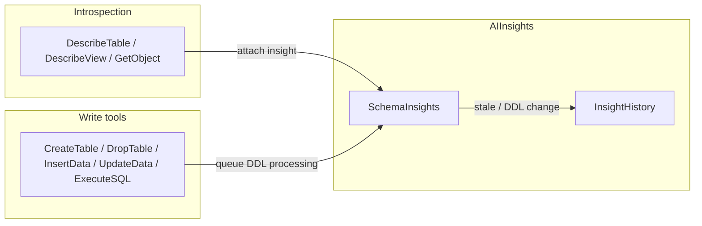

# MSSQL MCP Server (.NET 9)

A [Model Context Protocol](https://modelcontextprotocol.io/) (MCP) server for Microsoft SQL Server and Azure SQL Database. Built with the official [MCP C# SDK](https://github.com/modelcontextprotocol/csharp-sdk) (`ModelContextProtocol` 0.1.0-preview.10) on .NET 9.

Forked from [Azure-Samples/SQL-AI-samples](https://github.com/Azure-Samples/SQL-AI-samples) and extended with unified object introspection, strict read/write SQL routing, and an optional **AI Insights** cache layer that helps LLM agents investigate databases with less repeated schema work.

## Table of contents

- [Requirements](#requirements)
- [Quick start](#quick-start)
- [MCP client configuration](#mcp-client-configuration)
- [Environment variables](#environment-variables)
- [MCP tools reference](#mcp-tools-reference)
- [AI Insights layer](#ai-insights-layer)
- [Response shape](#response-shape)
- [Build, publish, and test](#build-publish-and-test)
- [Project layout](#project-layout)
- [Security notes](#security-notes)
- [Troubleshooting](#troubleshooting)
- [License](#license)

## Requirements

| Component | Version |
|-----------|---------|
| .NET SDK / Runtime | **.NET 9.0** |
| SQL Server | **2008 R2 (10.50)** or later |
| Azure SQL Database | Supported |

Tested target versions include SQL Server 2008 R2 through 2022 and Azure SQL Database.

The server validates `CONNECTION_STRING` and opens a test connection **before** starting the MCP transport. If either check fails, the process exits with code `1` and writes diagnostics to the log file.

## Quick start

```powershell
# Clone and build
cd MssqlMcp
dotnet build

# Run unit tests (no live DB required for most tests)
cd ..
dotnet test
```

Point your MCP client at the built executable:

```
MssqlMcp\bin\Debug\net9.0\MssqlMcp.exe
```

Set `CONNECTION_STRING` in the MCP server environment (see [sample_mcp.json](sample_mcp.json) for a template).

**First prompt to try:** “List tables in the database” (the agent should call `ListObjects` with `objectType=Table`).

## MCP client configuration

### Cursor

Add a project-level or user-level MCP config. Example (adjust paths and connection string):

```json
{
  "mcpServers": {
    "MSSQL-MCP": {
      "type": "stdio",
      "command": "C:\\Development\\MCPs\\MS-SQL\\MssqlMcp\\bin\\Debug\\net9.0\\MssqlMcp.exe",
      "env": {
        "CONNECTION_STRING": "Server=.;Database=MyDb;Trusted_Connection=True;TrustServerCertificate=True",
        "USE_INSIGHTS_LAYER": "true",
        "INSIGHTS_AUTOPOPULATE": "true",
        "LOG_FILE_PATH": "C:\\Logs\\mssql-mcp.log"
      }
    }
  }
}
```

Restart the MCP server after changing environment variables.

### VS Code (GitHub Copilot Agent)

Open **Settings (JSON)** and add under `mcp.servers`:

```json
"mcp": {
  "servers": {
    "MSSQL MCP": {
      "type": "stdio",
      "command": "C:\\path\\to\\MssqlMcp.exe",
      "env": {
        "CONNECTION_STRING": "Server=.;Database=test;Trusted_Connection=True;TrustServerCertificate=True"
      }
    }
  }
}
```

### Claude Desktop

Edit `claude_desktop_config.json`:

```json
{
  "mcpServers": {
    "MSSQL MCP": {
      "command": "C:\\path\\to\\MssqlMcp.exe",
      "env": {
        "CONNECTION_STRING": "Server=.;Database=test;Trusted_Connection=True;TrustServerCertificate=True"
      }
    }
  }
}
```

### Azure SQL (Entra ID interactive)

```json
"CONNECTION_STRING": "Server=tcp:<server>.database.windows.net,1433;Initial Catalog=<database>;Encrypt=Mandatory;TrustServerCertificate=False;Connection Timeout=30;Authentication=Active Directory Interactive"
```

### Production-style single-file publish

```powershell
.\publish-release.ps1
```

This produces a self-contained `MssqlMcp.exe` (default output: `C:\Development\MCPs\MS-SQL-Release\`). Point MCP clients at that executable instead of the Debug build.

## Environment variables

| Variable | Required | Default | Description |
|----------|----------|---------|-------------|
| `CONNECTION_STRING` | **Yes** | — | ADO.NET connection string for the target database. Validated at startup. |
| `USE_INSIGHTS_LAYER` | No | enabled | Opt-**out** switch. Set to `false`, `0`, `no`, `off`, or `disabled` to disable the AI Insights layer. Any other value (including unset) leaves it enabled. |
| `INSIGHTS_AUTOPOPULATE` | No | enabled | Opt-out. When enabled (and insights layer is on), introspection auto-creates mechanical baseline insights and attaches enrichment directives. Set to a falsey value to disable auto-population only. |
| `LOG_FILE_PATH` | No | `%LOCALAPPDATA%\MssqlMcp\Logs\` (Windows) or `~/.local/share/MssqlMcp/Logs/` (Linux/macOS) | Full file path, or a directory (timestamped log files are created inside it). |

When both `USE_INSIGHTS_LAYER` and `INSIGHTS_AUTOPOPULATE` are enabled, the server also enables baseline row-count probing, baseline refresh during DDL scans, and `insightEnrichment` response directives (all derived from those two flags — there are no separate env vars for them).

## MCP tools reference

The server exposes **19 tools** through a single partial `Tools` class. Legacy per-type list/get tools (`ListTables`, `GetStoredProc`, etc.) remain as internal helpers; clients should use the unified tools below.

### Read-only inspection

| Tool | Purpose |
|------|---------|
| **ListObjects** | List objects by `objectType`: `Table`, `View`, `StoredProcedure`, `TableFunction`, `ScalarFunction`, `Function` (scalar + table), `TableTrigger`, `SysObject`. Optional `partialName` does a `LIKE` filter on name and `schema.name`. For `SysObject`, optional `sysObjectType` filters by `sys.objects.type` (`U`, `V`, `P`, `FN`, …). |
| **DescribeTable** | Full table metadata: columns (type, nullability, descriptions), indexes, constraints, foreign keys, triggers. Preferred over ad-hoc `sys.*` queries for one table. |
| **DescribeView** | View metadata, column list, and full T-SQL definition. |
| **GetObject** | Stored procedure, function, or trigger: parameters (where applicable) + definition. `objectType`: `StoredProcedure`, `Function`, or `Trigger`. Trigger names accept `name`, `schema.name`, or `schema.table.name`. |
| **ReadData** | **All** read-only `SELECT` / `WITH … SELECT` queries. Use for user tables, `sys.*`, `INFORMATION_SCHEMA`, and DMVs. |
| **GetServerInfo** | Server version/edition, hardware DMVs (with graceful degradation), and user-database counts. |

### Data modification and DDL

| Tool | MCP flags | Purpose |
|------|-----------|---------|
| **CreateTable** | write | Run a `CREATE TABLE` statement. |
| **DropTable** | write, destructive | Run a `DROP TABLE` statement. Confirm with the user first. |
| **InsertData** | write | Run a single `INSERT` statement. |
| **UpdateData** | write, destructive | Run a single `UPDATE` statement. Always use a `WHERE` clause. |
| **ExecuteSQL** | write, destructive | DDL/DML only (`INSERT`, `UPDATE`, `DELETE`, `MERGE`, `CREATE`, `ALTER`, `DROP`, `TRUNCATE`, `EXEC`, …). **SELECT is rejected** — use `ReadData`. Multi-batch `GO` scripts are not supported. |

### AI Insights (8 tools)

Requires `USE_INSIGHTS_LAYER` enabled (default) and **InstallInsightsLayer** run once per database.

| Tool | Purpose |
|------|---------|
| **InsightsCheck** | Reports layer install state, DDL audit presence, insight row count, and DDL processing watermark. |
| **InstallInsightsLayer** | Idempotent install of `AIInsights` schema, `SchemaInsights`, `InsightHistory`, `DdlChangeWatermark`, `dbo.DDL_AuditLog`, and the database-level `DDL_Audit` trigger. |
| **GetInsight** | Read cached insight + freshness for one object. |
| **UpsertInsight** | Create or update a cached insight (UPDATE-then-INSERT; fingerprint captured server-side). |
| **ListInsights** | Recent rows from `AIInsights.SchemaInsights`. |
| **GetInsightHistory** | Archived rows from `AIInsights.InsightHistory`. |
| **RefreshInsights** | Process DDL backlog / fingerprint drift; returns recent summaries. |
| **RebuildBaselineInsights** | Bulk warm mechanical baselines (`schemaName?`, `objectType?`, `take` 1–2000). |

When `USE_INSIGHTS_LAYER=false`, insight-specific tools return errors or empty status; introspection tools skip insight enrichment.

### Read vs execute routing

`SqlStatementClassifier` enforces a strict split:

- **ReadData** — `SELECT` and read-only `WITH … SELECT` only. `SELECT … INTO` is rejected.
- **ExecuteSQL** — everything else that mutates schema or data. Any `SELECT` is rejected with a message pointing to `ReadData`.

This keeps destructive operations behind an explicitly flagged tool and prevents accidental full-table reads through the write path.

## AI Insights layer

The AI Insights layer caches LLM-authored (or server-generated baseline) summaries of database objects so repeated investigations cost fewer tokens. It is **enabled by default** but **not auto-installed** — call **InstallInsightsLayer** once per database.

### What gets installed

- **`AIInsights` schema** — `SchemaInsights`, `InsightHistory`, `DdlChangeWatermark`, and related objects (embedded SQL in `InsightsLayer/SqlScripts/`).
- **`dbo.DDL_AuditLog`** — captures DDL events via a database-level trigger.
- **`DDL_Audit` trigger** — requires `ALTER ANY DATABASE DDL TRIGGER` (or `ddl_admin` / `sysadmin`).

Install is idempotent; re-running is safe.

### How it works



1. **Read path** — `DescribeTable`, `DescribeView`, and `GetObject` attach `insight`, `insightFreshness`, and optionally `enrichmentSuggested` / `insightEnrichment` to their responses (best-effort; never fails the parent tool).
2. **Freshness** — On read, the service compares the cached row’s schema fingerprint and `modify_date` to the live object. Mismatches archive the row to `InsightHistory` and return `insightFreshness: StaleArchived`.
3. **Auto-population** — When `INSIGHTS_AUTOPOPULATE` is enabled (default), absent or stale insights trigger a mechanical baseline (`LlmModel = "auto-mechanical"`, `Confidence = 0.30`) built from `sys.*` metadata.
4. **Enrichment contract** — Baseline rows set `enrichmentSuggested: true` and include an `insightEnrichment` block with a pre-filled `UpsertInsight` payload. MCP-aware agents should upgrade these rows before answering the user (protocol **MCP-Insight-Enrichment-v1**). See [.cursor/skills/mssql-insights-ops/SKILL.md](.cursor/skills/mssql-insights-ops/SKILL.md) for the full agent workflow.
5. **Write path** — After successful writes, a background `InsightDdlProcessingQueue` drains DDL audit rows (or falls back to fingerprint scans) and archives affected insights. When auto-population is on, baselines are rebuilt for archived objects.

### Recommended first-time workflow

```
1. GetServerInfo
2. InsightsCheck
3. InstallInsightsLayer          (if schema or DDL trigger missing)
4. ListObjects(objectType=Table)
5. DescribeTable(name=…)        (inspect insight / enrichmentSuggested)
6. UpsertInsight(…)              (when enrichmentSuggested is true)
```

### `insightFreshness` values

| Value | Meaning |
|-------|---------|
| `Fresh` | Cached insight matches live object definition. |
| `Absent` | No row in `SchemaInsights` (baseline may be created on next introspection if auto-pop is on). |
| `StaleArchived` | Row was archived due to DDL or fingerprint drift. |
| `LayerDisabled` | `USE_INSIGHTS_LAYER=false`. |
| `AccessDenied` | Could not read live definition (permissions). |
| `DefinitionUnavailable` | Object exists but definition could not be resolved. |

## Response shape

All tools return `DbOperationResult`:

```json
{
  "success": true,
  "error": null,
  "rowsAffected": 0,
  "data": { }
}
```

- `success` — whether the operation completed without error.
- `error` — message when `success` is false.
- `rowsAffected` — for DML tools (`InsertData`, `UpdateData`, `ExecuteSQL`, …).
- `data` — tool-specific payload (object metadata, row arrays, insight status, …).

Introspection tools may add top-level keys inside `data` for insights (`insight`, `insightFreshness`, `enrichmentSuggested`, `insightEnrichment`, `_agentDirective`, `pendingEnrichments`).

## Build, publish, and test

### Build

```powershell
dotnet build MssqlMcp.sln
dotnet build MssqlMcp.sln -c Release
```

### Test

```powershell
dotnet test MssqlMcp.sln -c Release
```

| Test project area | Coverage |
|-------------------|----------|
| `SqlStatementClassifierTests` | Read vs execute SQL routing |
| `TriggerQualifiedNameTests` | `schema.table.trigger` name parsing |
| `InsightsLayerEnvironmentTests` | Env var opt-out semantics |
| `InsightsLayerNoOpTests` | Disabled-layer behavior |
| `SqlBatchSplitterTests` | Embedded SQL script splitting |
| `GetServerInfoTests` | Server info response shape |
| `UnitTests` | General helpers |
| `InsightsLayerDbSmokeTests` | Live DB integration (**skipped** unless `RUN_INSIGHTS_DB_TEST=1`) |

For integration tests, set `CONNECTION_STRING` to a real database. The test project falls back to `(localdb)\MSSQLLocalDB` when unset.

```powershell
$env:RUN_INSIGHTS_DB_TEST = "1"
$env:CONNECTION_STRING = "Server=.;Database=TestDb;Trusted_Connection=True;TrustServerCertificate=True"
dotnet test MssqlMcp.sln -c Release
```

### Publish single-file executable

```powershell
.\publish-release.ps1
# Optional: .\publish-release.ps1 --verbosity normal
```

Output path is configured in `MssqlMcp/MssqlMcp.csproj` and `Properties/PublishProfiles/ReleaseSingleFile.pubxml` (default: `C:\Development\MCPs\MS-SQL-Release\MssqlMcp.exe`).

## Project layout

```
MS-SQL/
├── MssqlMcp/                    # MCP server (.NET 9 exe)
│   ├── Program.cs               # Startup, logging, DI, stdio transport
│   ├── SqlConnectionFactory.cs  # CONNECTION_STRING → SqlConnection
│   ├── SqlStatementClassifier.cs
│   ├── TriggerQualifiedName.cs
│   ├── DbOperationResult.cs
│   ├── InsightsLayer/           # AI Insights service + embedded SQL
│   │   ├── InsightsLayerService.cs
│   │   ├── InsightDdlProcessingQueue.cs
│   │   └── SqlScripts/
│   └── Tools/                   # MCP tools (partial class Tools)
├── MssqlMcp.Tests/              # xUnit tests
├── sample_mcp.json              # Example MCP config
├── publish-release.ps1
└── .cursor/skills/mssql-insights-ops/SKILL.md   # Agent playbook for insights
```

## Security notes

- **Connection strings** live in MCP client config / environment variables — never commit real credentials to the repo.
- **ExecuteSQL**, **DropTable**, and **UpdateData** are marked destructive in MCP metadata; agents should confirm intent with the user.
- **ReadData** and **ExecuteSQL** do not support parameterized queries — literals are embedded in SQL. Do not pass untrusted user input through these tools without sanitization.
- **DDL audit trigger** installation requires elevated database permissions; use a dedicated database role in production.
- Startup logs mask password fields in connection strings; other secrets in the connection string are still logged — prefer Windows / Entra authentication where possible.

## Troubleshooting

### `MCP error -32000: Connection closed`

The server exited before or during MCP handshake. Check the log file:

| Config | Location |
|--------|----------|
| `LOG_FILE_PATH` set to file | That file |
| `LOG_FILE_PATH` set to directory | New `mssql-mcp-*.log` inside it |
| Default (Windows) | `%LOCALAPPDATA%\MssqlMcp\Logs\mssql-mcp-*.log` |
| Default (Linux/macOS) | `~/.local/share/MssqlMcp/Logs/mssql-mcp-*.log` |

Logs include process info, masked connection string, SQL connection test results, and stack traces.

### Common failures

| Symptom | Likely cause | Fix |
|---------|--------------|-----|
| Immediate exit code 1 | `CONNECTION_STRING` not set | Add it to MCP `env` |
| Connection test failed | Wrong server/database/auth | Verify string outside MCP (`sqlcmd`, SSMS) |
| InstallInsightsLayer permission error | Missing DDL trigger rights | Grant `ALTER ANY DATABASE DDL TRIGGER` or use `ddl_admin` |
| ExecuteSQL rejects SELECT | By design | Use **ReadData** for all queries that return rows |
| Insight tools return "layer is disabled" | `USE_INSIGHTS_LAYER=false` | Remove or set to `true`; restart server |
| Hardware fields null in GetServerInfo | Missing `VIEW SERVER STATE` | Expected on restricted accounts; see `hardware.warning` |

### Missing .NET runtime

Install [.NET 9.0 Runtime](https://dotnet.microsoft.com/download/dotnet/9.0) on the machine running `MssqlMcp.exe` (not required for self-contained publish output).

## License

Copyright (c) Microsoft Corporation. Licensed under the [MIT license](LICENSE).
